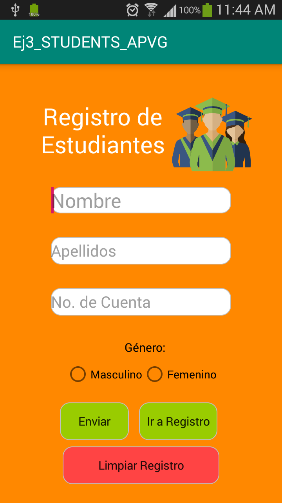

# Ej3_LV_STUDENTS_APVG -  Students Register - Aplicación que realiza el registro de estudiantes como items en un listView que los categoriza por género

Aplicación que permite al usuario registrar un número indeterminado de estudiantes, contemplando el nombre, apellidos, número de cuenta y género de éstos.
El registro de los alumnos se almacena en un listView dentro de otra Activity, y en ella cada item/alumno cuenta con un ícono que los identifica por género.
Al dar click/presionar un item, se desplegará un mensaje Toast que indica su ID.

Es posible borrar el registro de estudiantes al presionar el botón destinado para ello.

*<b>Primera Activity</b> - La primera activity muestra el nombre de la aplicación y un formulario para ingresar los datos del alumno a registrar. Por otro lado, incluye
                            3 botones: uno para enviar la información, otro para consultar el registro y un tercero para borrarlo.
                            
 
