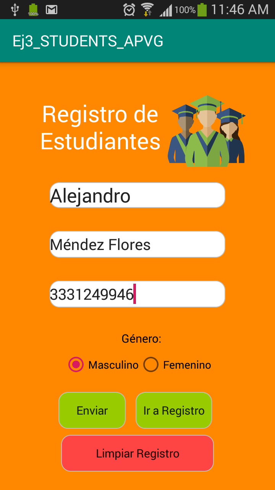
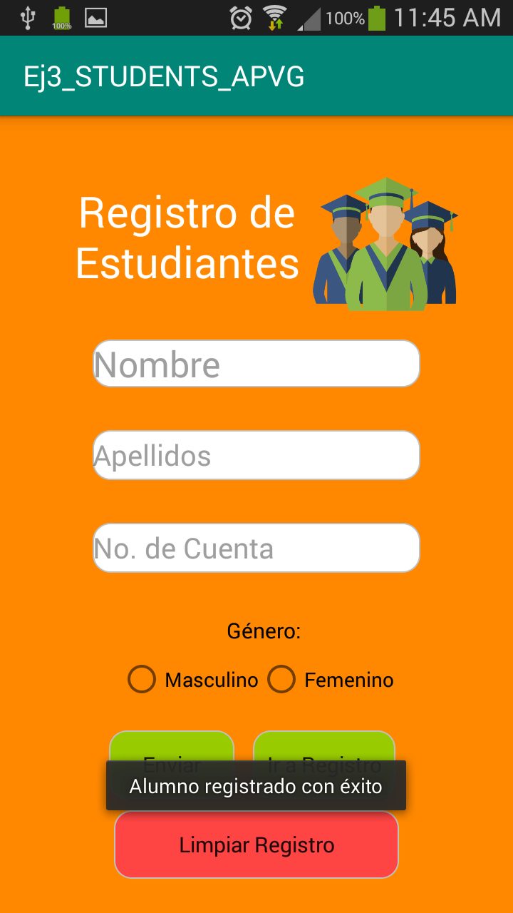
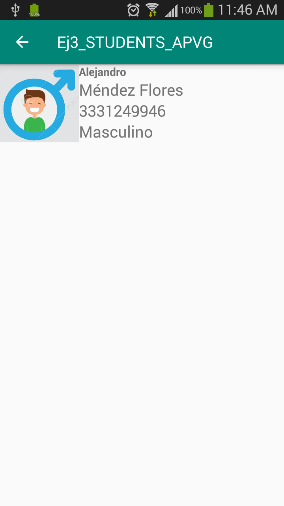
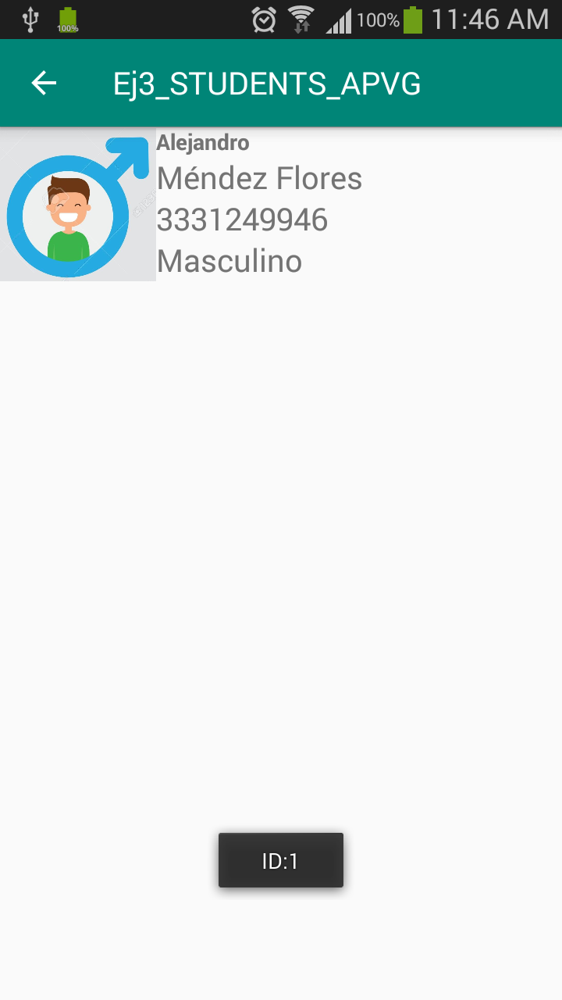
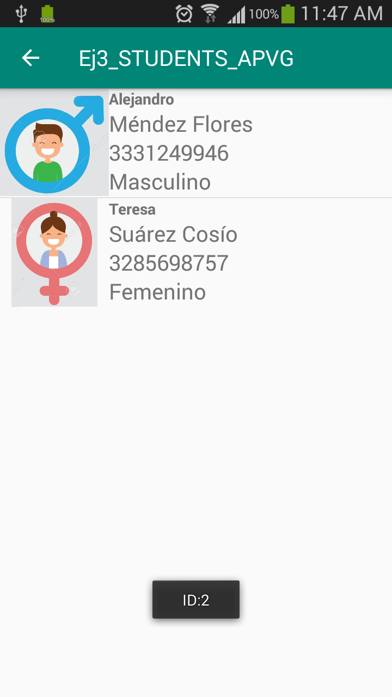

# Ej3_LV_STUDENTS_APVG -  Students Register - Aplicación que realiza el registro de estudiantes como items en un listView que los categoriza por género

Aplicación que permite al usuario registrar un número indeterminado de estudiantes, contemplando el nombre, apellidos, número de cuenta y género de éstos.
El registro de los alumnos se almacena en un listView dentro de otra Activity, y en ella cada item/alumno cuenta con un ícono que los identifica por género.
Al dar click/presionar un item, se desplegará un mensaje Toast que indica su ID.

Es posible borrar el registro de estudiantes al presionar el botón destinado para ello.

*<b>Primera Activity</b> - La primera activity muestra el nombre de la aplicación y un formulario para ingresar los datos del alumno a registrar. Por otro lado, incluye
                            3 botones: uno para enviar la información, otro para consultar el registro y un tercero para borrarlo.
                            
 
 
 Al presionar el botón de envío (con el formulario llenado adecuadamente), el estudiante se registrará y se desplegará un mensaje Toast indicador del registro exitoso.
 
 
 
 Al presionar el botón para consulta de registro, se dirigirá al usuario a la segunda activity, contenedora del listView con el registro.
 
 *<b>Segunda Activity</b> - Como se ha mencionado anteriormente, la segunda activity contiene el regsitro de los estudiantes asentados con el formulario, dentro de un listView. Este listView cuenta con un adaptador custom por item para mostrar los atributos del correspondiente alumno ingresado y un ícono que lo identifica por género (masculino o femenino).
 
  
  
  Cuando se presiona al item, se despliega un mensaje Toast que muestra su ID
  
  
  
  Si se ingresan más estudiantes, éstos tendrán su propio ID.
   
   
   Por otro lado, regresando a la primera activity, al presionar el botón para borrar el registro se efectuará la eliminación de items y se despliegará un mensaje Toast indicador
   
    
    
    
  
  
  
  
 
 
 
